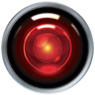
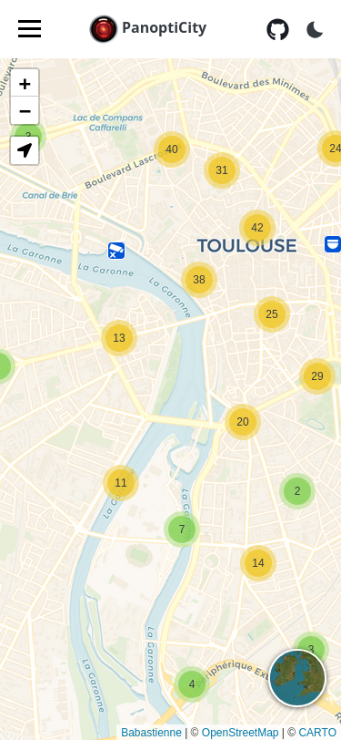
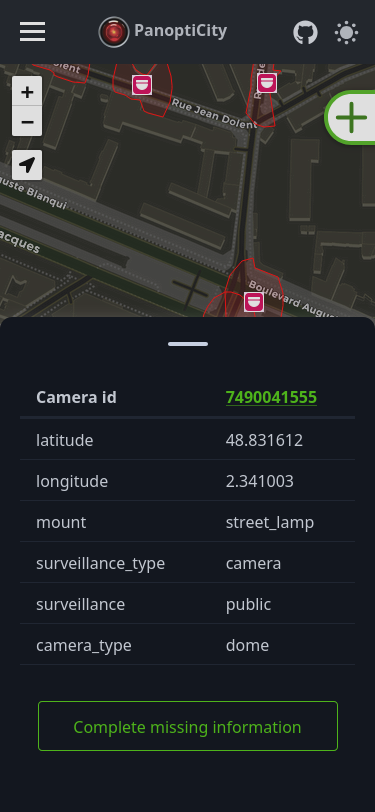
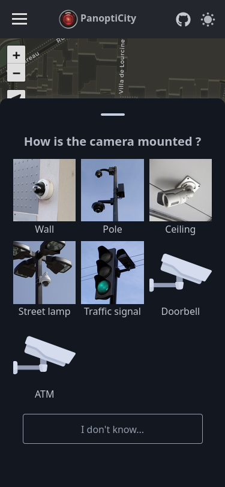
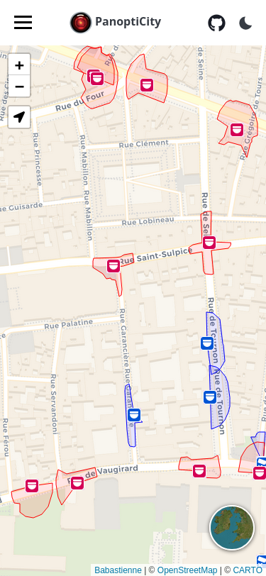

# PanoptiCity



- [PanoptiCity](#panopticity)
  - [Introduction](#introduction)
    - [Screenshots](#screenshots)
    - [Supported features](#supported-features)
  - [Installation](#installation)
    - [Download the project and requirements](#download-the-project-and-requirements)
    - [Set project environement](#set-project-environement)
    - [Initialize database](#initialize-database)
    - [Import initial data and update](#import-initial-data-and-update)
      - [Steps to import data](#steps-to-import-data)
      - [Steps to update the cameras](#steps-to-update-the-cameras)
      - [Steps to update the buildings](#steps-to-update-the-buildings)
    - [Run the website for production](#run-the-website-for-production)
    - [Development](#development)
  - [Configuration](#configuration)
    - [Translations](#translations)
    - [Burger Menu](#burger-menu)
  - [Calculation methods for field of view](#calculation-methods-for-field-of-view)
    - [What is the field of view](#what-is-the-field-of-view)
    - [The lack of data in OpenStreetMap](#the-lack-of-data-in-openstreetmap)
  - [More information](#more-information)
    - [Create or tag multiple cameras on same location](#create-or-tag-multiple-cameras-on-same-location)
    - [Complementary resources](#complementary-resources)
      - [CCTV Effectiveness](#cctv-effectiveness)
      - [Websites about mass surveillance](#websites-about-mass-surveillance)
      - [Fight back](#fight-back)
  - [Legal information for nerds](#legal-information-for-nerds)
    - [Attribution](#attribution)
      - [Cartography](#cartography)
      - [OpenStreetMap](#openstreetmap)
      - [Backend](#backend)
      - [Frontend](#frontend)
      - [Images](#images)
    - [License](#license)

## Introduction

Welcome to PanoptiCity !

This project's purpose is to help display information about CCTV, cameras, to easily map where they are, what they can see, and get data about their usage in cities. The website also give users an easy way to contribute into the OpenStreetMap database if they want to add cameras when they see some that are not already known or improve the attributes of existing ones.

PanoptiCity is my way to act and try to raise awareness about mass surveillance in all cities, to make people realize the amount of cameras around us that they usually not even see. In a time were artifical intelligence is generalizing, it is more than ever the moment to ask ourselves, is it really the model of society we want to build collectively ?

One major inspiration for this project has been the website [SunderS](https://sunders.uber.space/). It gave me the idea of improving the project with new features and therefore obviously needs to be cited. Information used is from the awesome [OpenStreetMap](https://www.openstreetmap.org/) database. Other attributions and projects used for this application can be found later on this page.

### Screenshots

|                         |            |
| --------------------------------------------------------- | --------------------------------------------------------- |
|  |  |

### Supported features

- Get data from OpenStreetMap database
- Compute field of vision of each camera, take in consideration surounding buildings
- Connection with OpenStreetMap account
- Edition of existing cameras
- Creation form to contribute new cameras
- Dark/light mode

## Installation

Thank you for your interest in this project. This section will guide you to facilitate the installation, configuration and run of the project on your server.

If you encounter any problem feel free to [open an issue](https://github.com/babastienne/PanoptiCity/issues/new) to ask for support.

### Download the project and requirements

To run this application you'll need docker.

1. If not done already, [install docker](https://docs.docker.com/engine/install/) on the server.
2. Download this project : `git clone https://github.com/babastienne/panopticity`
3. Go to the downloaded folder : `cd panopticity`

### Set project environement

Define some variables used by the application by editing environment variables :

- `cp .env.dist .env`
- Then edit the `.env` file and replace the variables values by the ones you want to use.
- Edit the configuration file for the front-end `front-end/CONFIG.js` and override with your parameters.

### Initialize database

It is now time to launch the project for the first time :

1. Initialize the database by running `docker compose run --rm postgis`. When you see `database system is ready to accept connections` you can exit by doing `ctr+c` (should not take more than a few seconds).
2. Then create the database structure by applying Django migration. To do so run: `docker compose run --rm web ./manage.py migrate`

### Import initial data and update

To import data to your project, you need to download file corresponding to the area you want to cover. This file will be used to import cameras as well as buildings (needed to compute the field of view of each camera). After this initial update you have two options :

1. Keep on your server the original file : it'll be used to replicate future modifications done in OpenStreetMap. Usefull if you want to keep your building database up to date with new modifications.
2. Remove the original file : you'll still have the possiblity to get updates for cameras but not for the buildings.

> By default this project come with sample data so you can follow the import procedure without having to download any file (usefull if you just want to test or develop on the project).

In OpenStreetMap, there is multiple ways of keeping informations up to date. On this project we choose to import data from [PBF files](https://wiki.openstreetmap.org/wiki/PBF_Format). To keep change of the updates we use [diff files](https://wiki.openstreetmap.org/wiki/Planet.osm/diffs) that are generated regularly. It can by : daily / hourly / minutely.

Depending on the frequency of updates you want and the area you wish to cover, you'll need to choose where to download your data file. Few suggestions :

- https://planet.openstreetmap.org/ : Official source with possiblity to keep change daily / hourly / minutely. It is only for the entire planet therefore the file size can be important and the database for buldings may not be able to keep up without good resources.
- https://download.openstreetmap.fr/ : Daily extracts and minutely diffs. Files are splits into continents / countries / states. Very usefull to download specific region and keep up with the changes almost in real time.

You can find an up to date list of mirrors on the [OpenStreetMap dedicated wiki page](https://wiki.openstreetmap.org/wiki/Planet.osm) to explore more options. If you want to keep your data up to date you'll need to find one that handle diffs.

<!-- This mechanism is fundamental for this project to work. In the following sections we will need two files to work with:

- One data file, in pbf format (usually formated as `<region>.osm.pbf`)
- One sequence state file, in txt format (usually formated as `<region>.state.txt`) -->

We will refer at your downloaded pbf file as `<my-pbf-file>` and in the next commands.

#### Steps to import data

1. Download both your desired pbf and state files and put them in the `osm-data` folder. (_If you want to use sample data you can skip this step_)

2. Import the buildings in the database (can take some time depending of your area. For loading entire France it took 12 minutes) by running the following command:

```
   docker compose run osm2pgsql -O flex -S /data/buildings.lua /osm-data/<my-pbf-file>
```

3. Load cameras (usually takes more time than the previous command):

```
   docker compose run --rm web ./manage.py load_cameras /osm-data/<my-pbf-file>
```

#### Steps to update the cameras

- Generate your state file from your original data file. To do so run the command: `docker compose run --rm web pyosmium-get-changes -O /osm-data/<my-pbf-file> -f /osm-data/sequence.state.txt -v`. It will create a state file in `osm-data/sequence.state.txt`.

> After this step, if you don't want to update your buildings in the future and want to save some space on your server you can download your original data file.

- This last command should have prompted something an URL on the terminal. Probably in the format `INFO: Using replication server at <URL_OF_THE_REPLICATION_SERVER>` This is the URL that will be used to get diffs. Copy it and then you can run the following lines to update your cameras (replace with your url):

1. `docker compose run --rm web pyosmium-get-changes --server <URL_OF_THE_REPLICATION_SERVER> -f /osm-data/sequence.state.txt -o /osm-data/diff.osc.gz` > This command creates a diff file (the file `osm-data/diff.osc.gz`) that contains every differences between the original data file and the last version of OSM data on the replication server. The command also edit the sequence.state.txt file to update the sequence number with the last version fetched on the server.
2. `docker compose run --rm web ./manage.py load_cameras -d -u /osm-data/diff.osc.gz` > This command updates the camera database with the differences.
3. (Optionnal) the `osm-data/diff.osc.gz` can be removed. It will otherwise be overwrite next time so this is not mandatory.

> Note: If you want to stay up to date, the last three commands can easily by put into a bash script and then launched regularly with a cron depending of your update frequency (minute, hour, day). The file `update-cameras.sh` is an example of something that can be done to automatize the process (it could be improved with log monitoring).

#### Steps to update the buildings

> Because of the volume of the building database, we recommand not to update those objects too often. The process consist of completely reloading the database from scratch so it is time consuming and therefore need to be done only occasionaly.

> To update your building database without having to completely re-download your data, you need to keep on your server your original data file. This file well be updated by the process.

1. `docker compose run --rm web pyosmium-up-to-date /osm-data/<my-pbf-file>` > This command will fetch the diffs since the last version of your file and apply them to your data file. This command can take some time depending of the last time you did the operation.
2. Re-create the building database : `docker compose run osm2pgsql -O flex -S /data/buildings.lua /osm-data/<my-pbf-file>`
3. (Option) Re-compute camera field of views (can be long) :

```
   docker compose run --rm web ./manage.py shell
   > from cameras.models import Camera
   > for elem in Camera:
   > elem.save()
   >
   > # This operation will be long
   >
   > exit()
   exit
```

We don't recommand to automatize this operation.

### Run the website for production

- To launch the back-end, you need to run `docker compose up -d`. The back-end will be running on localhost on port 8000. You need to configure your server as an http_proxy to this port. Anything behind then endpoint `/api` need to be available.
- The front-end is a static html website so it can be served by any web server.

An example of basic server configuration can be found on the file `nginx.conf.example`.

### Development

Pretty much the same as in production. If you want to contribute to this project there is some contribution ideas available on [todo.md](./todo.md). Don't hesitate to ask if you want to share ideas or need help to start.

## Configuration

### Translations

You can override translations of the front-end interface or add new languages by editing the file `front-end/translations.js`. By default the project is translated in english and french. To add a new language you need to duplicate the english object, change it's language code (for example put `es` for Spanish) and then translate the entries.

> Panopticity does not support the translations for countries variations (e.g `fr-CA` for Canadian french ; `en-US` for american english ; etc.). It only support main language translations. Any contribution to improve this behavior is welcome.

By default PanoptiCity check the language configuration of the use browser to determine the language to display. It does not allow the user to switch the language interface directly. If you wish to improve this feel free to contribute.

### Burger Menu

The latteral menu allow to display static content to give users some information about any subject.

By default PanoptiCity suggests some contents but you can override them to remove or add any entry. To do so, in the file `front-end/translations.js`, you'll need to edit the values under the `menuContent` object. Each sub-entry corresponds to an item to the menu. The key is the title of the content and the value is the body of the page. The value can contains HTML formated text. To simplify the formating it is also possible to use `\n` to split paragraphs.

## Calculation methods for field of view

### What is the field of view

The field of view is the area visible/covered by a CCTV. the field of view of every camera depends on a lot of variables. The most important are :

- The height of the camera
- The direction in which the camera is pointed
- The angle (tilt) of the camera that indicated if it is pointed toward the horizon or the floor
- The [resolution](https://en.wikipedia.org/wiki/Image_resolution) of the lens of the camera. This gives the number of pixels (e.g: 1920x1080 ~= 2MP ; 2556x1440 ~= 4MP ; 3840x2160 ~= 8MP ; etc.).
- The [focal lens](https://en.wikipedia.org/wiki/Camera_lens#Aperture_and_focal_length) of the lens. This mainly impact the angle of view and allow some cameras to be wide-angle (low focal) or on the opposite to focus on specific details (high focal). The focal is expressed in mm (e.g: 8mm ; 12mm ; 75mm).
- The [sensor format](https://en.wikipedia.org/wiki/Image_sensor_format) which is the ratio that indicates the size of the image (usually expressed as 1/2.5" ; 2/3" ; etc.).

The combination of those 3 parameters allow to determine the quality of an image for a specific distance. The quality is expressed in PPM (pixels per meters) representing the pixel density. For example for a camera of 1920x1080 resolution with a 25mm lens and a 1/3" format, the quality of the image of a person standing 10 meters away from the camera will be 998ppm.

By taking those elements in consideration, we can compute the field of view of camera in which a person can be identified, recognized, detected. We use this matching table to establish what quality corresponds to what level :

| Level of surveillance                                                                                                                                                                                              | Image quality |
| ------------------------------------------------------------------------------------------------------------------------------------------------------------------------------------------------------------------ | ------------- |
| Identification: At this level a person can easily be identified by any human or automated program.                                                                                                                 | > 250 PPM     |
| Recognition: Some specific details can be seen. Not enough details to automatize the recognition but a targeted person can still be recognized by a human eye. This quality level can be used for forensic review. | 250 - 65 PPM  |
| Observation: It is possible to detect persons, objects and movements but not to identify details. Usually for large non targeted observation.                                                                      | 25 - 65 PPM   |
| Not usable                                                                                                                                                                                                         | < 25 PPM      |

> The level of surveillance and corresponding qualities are inspired from this [Department of Homeland Security document about VideoSurveillance Quality](https://www.dhs.gov/sites/default/files/publications/VQiPS_Digital-Video-Quality-HB_UPDATED-180117-508.pdf).

It is important to note that a lot of modern cameras have the ability to zoom and move. We talk about dome or PTZ cameras (Pan-Tilt-Zoom). It means that for a lot of devices the variables (particularly the focal) can change depending if the camera is zoomed or not. Public cameras can generally alternate between wide angle and zoomed views depending on the operator or detection algorythm behind.

### The lack of data in OpenStreetMap

Obvisouly for each camera the information about resolution, focal and sensor format are not in the OpenStreetMap database. First because it would be a pain to contribute but mainly because it is not possible to get this information even when on field.

The other variables (height, angle and direction) are more easy to declare in OpenStreetMap. Panopticity encourage users to declare the height of a camera every time as well as the direction and the angle when it's a fixed or panning camera.

**If sometimes there is no data, how can we determine what are the values that should be used in Panopticity then ?**

For basic information, we use default values if they are not tagged in OSM. If they are presents we use them. Default values are:

| Field     | Default Value                                                                              |
| --------- | ------------------------------------------------------------------------------------------ |
| Height    | 5 meters                                                                                   |
| Angle     | 15°                                                                                        |
| Direction | No default value. If a fixed camera does not have direction, no field of view is displayed |

For the other fields, to make an estimation, we compiled in a file the technnical information of more than TODO models of CCTV cameras from TODO differents brands. This gave us a global view of the current technical level of the CCTV market as it is in 2025. Keep in mind that new camera models are released every week so depending when you read this lines the numbers can be differents today.

The numbers used can be seen in the TODO file.

With those numbers, we sorted every variable and were able to determine statistics about quality of cameras. Depending of the camera type (fixed or dome/PTZ cameras), we created three models to help us determine the quality of cameras (and therefore their field of view):

| Scenario            | Description                                                                                                                                                                                           | Values for Fixed Cameras | Dome/PTZ Cameras |
| ------------------- | ----------------------------------------------------------------------------------------------------------------------------------------------------------------------------------------------------- | ------------------------ | ---------------- |
| Best Case Scenario  | This is the scenario corresponding to the first decile which means that 90% of cameras on the market have better quality that what is displayed on map as the field of view                           | TODO                     | TODO             |
| Mean / Average      | The default scenario. There are as many cameras with better quality than the displayed field of view as there are with poorer quality                                                                 | TODO                     | TODO             |
| Worst Case Scenario | This is the scenario corresponding to the last decile, which means that the displayed field of view on map is like if all cameras were in the top 10% of the market (in terms of technical abilities) | TODO                     | TODO             |

**How it could be improved**

One good way to improve this models would be to create a correlation between every camera model and their sales numbers to ponderate the weight of each camera in the model computation. However thoses numbers can't be easily found.

## More information

Wow, you're still there ? I guess you're really interested in this project. Here is some usefull information and resources.

### Create or tag multiple cameras on same location

If you see multiple cameras at the same location (for example on the same pole), it is advised to create one entry for each camera and set the location the closest as possible. This way it will ensure the logic "one node in OSM = one object in real life".

This way of representing objects has been discussed in the community and seems to be the recommanded way:

- See [this discussion](https://community.openstreetmap.org/t/how-to-tag-multiple-cameras-on-one-supporting-pole/2070) (in english)
- Or [almost the same](https://forum.openstreetmap.fr/t/marquer-plusieurs-cameras-sur-un-meme-mat/13427) (in french)

### Complementary resources

One inspiration for this project has been the SunderS project. Lot of resources can already be [found on their website](https://sunders.uber.space/#where).

#### CCTV Effectiveness

[Multiple studies](https://scholar.google.com/scholar?hl=en&as_sdt=0%2C5&q=cctv+effectiveness&btnG=&oq=cctv) has been conducted to measure effectiveness of CCTV in public areas. It usually shows relative effectiveness but not in the spots we could imagine: in car parkings and residential areas ... so not really in public spaces and city centers.

Also, [field studies](https://academicworks.cuny.edu/cgi/viewcontent.cgi?article=1275&context=jj_pubs) in cities have shown that video surveillance does not significantly help to solve investigations, nor does it reduce the number of violent crimes, drug-related offences or public order disturbances in cities. There are a number of reasons for this ineffectiveness: lack of coordination between security forces (private, state, municipal), poor quality images, misdirected or dirty cameras, etc. But the major problem is the staggering number of video streams compared with the small number of officers who are supposed to be using them.

Moreover, few studies really compare CCTV costs in comparison with human investments, wich could be interesting.

Finally, in a rising AI age, this really asks more about what we want to do collectively as society and where we want to go. Does little effectiveness justify global surveillance and death of anonymity ?

#### Websites about mass surveillance

- [TechnoPolice](https://technopolice.fr/) by La Quadrature Du Net (french)
- [Big Brother Watch](https://bigbrotherwatch.org.uk/)
- [Outperforming activism: reflections on the demise of the surveillance camera players](https://www.tandfonline.com/doi/full/10.1080/14794713.2015.1084797#d1e98)

#### Fight back

- Anonymize yourself with IR LEDs:
  - [The camera Shy Hoodie](https://www.macpierce.com/the-camera-shy-hoodie)
  - [Miss my face](https://urbanarmor.org/portfolio/miss-my-face/)
- Anti-recognition systems:
  - [Meet the activists perfecting the craft of anti-surveillance](https://www.ft.com/content/a0f8d8c5-ee5c-4618-bfbd-6bfb383b803e)
  - [Anti-Surveillance Makeup](https://www.nylon.com/beauty/on-anti-surveillance-makeup-and-just-how-effective-it-really-is)
  - [Clothes, masks, makeup and more](https://yr.media/tech/guide-to-anti-surveillance-fashion/)
- Disable cameras:
  - [With lasers](http://www.naimark.net/projects/zap/howto.html)
  - Or physicaly (paint, stickers, rocks ... be creative)

... and **add cameras that you spot in your daily life on OpenStreetMap !** The best way to fight back is to know your enemy, so help us map all the existing cameras so we can at least know where they are and try to avoid them (when possible).

## Legal information for nerds

### Attribution

This project is here thanks to the work of others. To create this website I've mainly used those following dependencies.

If you notice that I've used your project but don't see it in this list feel free to open an [issue](https://github.com/babastienne/PanoptiCity/issues/new) or a [pull request](https://github.com/babastienne/PanoptiCity/compare) so it can be added.

#### Cartography

- [Leaflet v1.9.4](https://github.com/Leaflet/Leaflet/releases/tag/v1.9.4) - _BSD 2-Clause License_
- [Leaflet.Locate v0.83.1](https://github.com/domoritz/leaflet-locatecontrol) - _MIT license_
- [Leaflet.Basemaps v0.2.1](https://github.com/consbio/Leaflet.Basemaps/releases/tag/0.2.1) - _ISC license_ (used a [forked version](https://github.com/consbio/Leaflet.Basemaps/pull/28))
- [Leaflet.markercluster v1.5.3](https://github.com/Leaflet/Leaflet.markercluster) - _MIT license_
- Map background attributions can be seen directly on map on the website

#### OpenStreetMap

- [OpenStreetMap](https://osmfoundation.org/) - _OBdL-1.0 license_
- [pyosmium v4.0.2](https://github.com/osmcode/pyosmium) - _BSD 2-Clause License_
- [osm2pgsql v2.0.1](https://github.com/osm2pgsql-dev/osm2pgsql) - _GPL-2.0 License_
- [osm-api-js v2.4.0](https://github.com/k-yle/osm-api-js/) - _MIT license_

#### Backend

- [Django v5.1](https://github.com/django/django) - _BSD-3-Clause license_
- [django-rest-framework-gis v1.1.0](https://github.com/openwisp/django-rest-framework-gis) - _MIT license_
- [django-rest-framework v3.15.2](https://github.com/encode/django-rest-framework) - _[license](https://github.com/encode/django-rest-framework/blob/master/LICENSE.md)_

#### Frontend

- [Pico CSS v2.0.6](https://github.com/picocss/pico) - _MIT license_

#### Images

- Logo: https://design-kink.com/hal-9000-2001-space-odyssey-free-vector-art/
- Pictograms for cameras: SunderS

### License

For this project, I've used a Cooperative Non-Violent Non-AI Public Software license. In brief (if you really intent to use this software [check the complete license](./LICENSE) though), you are free to use, modify, redistribute, commercialize and do pretty much everything you want with this software as long as:

- It is not used to exerce any violent action or repression or discrimination against any person. This software can't therefore be used by any law-enforcement administration or company ; (Non-Violent clause)
- If a commercial usage is made of this software, the financial gains are equaly redistributed among workers ; (Cooperative or Anticapitalist clause)
- The content of this project can't be used to train any artificial intelligence model ; (Non-AI clause)
