<h1 align="center">PanoptiCity</h1>

<bold>A life under surveillance</bold>

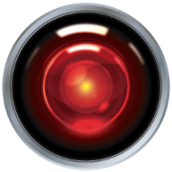

  
  

## Introduction

Welcome to PanoptiCity !

This project's purpose is to help display information about CCTV, cameras, to easily map where they are, what they can see, and get data about their usage in cities. The website also give users an easy way to contribute into the OpenStreetMap database if they want to add cameras when they see some that are not already known or improve the attributes of existing ones.

PanoptiCity is my way to act and try to raise awareness about mass surveillance in all cities, to make people realize the amount of cameras around us that they usually not even see. In a time were artifical intelligence is generalizing, it is more than ever the moment to ask ourselves, is it really the model of society we want to build collectively ?

**To learn more about the core ideas behind PanoptiCity, see the [complete manifesto](https://babastienne.github.io/PanoptiCity/manifest).**

### Screenshots

| 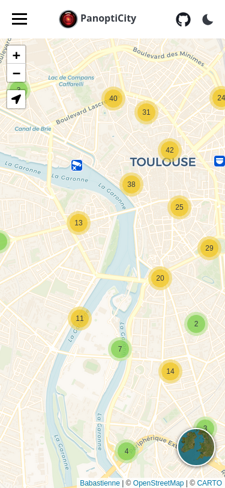                        | 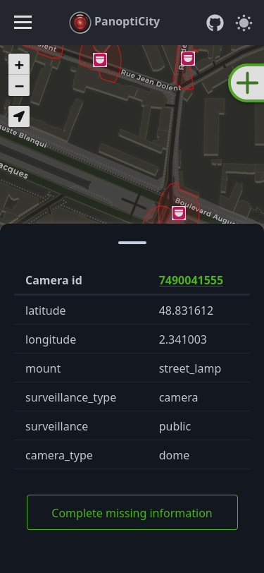           |
| --------------------------------------------------------- | --------------------------------------------------------- |
| 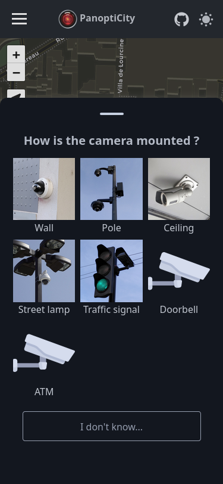 | 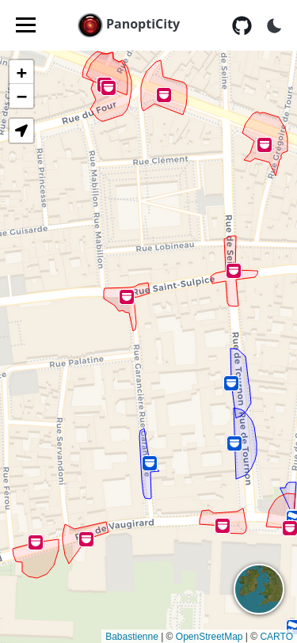 |

### Supported features

- Get data from OpenStreetMap database
- Compute field of vision of each camera, take in consideration surounding buildings
- Mutliple models for field of vision computation, based on an analysis of the technical features of available cameras on the cctv market. Possiblity to switch between models.
- Connection with OpenStreetMap account
- Edition of existing cameras
- Creation form to contribute new cameras
- Dark/light mode

To discover all the features, go to [panopticity.fr](https://panopticity.fr/) !

## Documentation

The entire technical documentation is available directly on [https://babastienne.github.io/PanoptiCity/](https://babastienne.github.io/PanoptiCity/). It covers:

- Installation
- Configuration
- Architecture
- Performances
- Development 
- Contributions

# :warning: **All sections below are being progressively moves to the documentation website** :warning:

### Development

Pretty much the same as in production. If you want to contribute to this project there is some contribution ideas available on [todo.md](./todo.md). Don't hesitate to ask if you want to share ideas or need help to start.

## Configuration

### Translations

You can override translations of the front-end interface or add new languages by editing the file `front-end/translations.js`. By default the project is translated in english and french. To add a new language you need to duplicate the english object, change it's language code (for example put `es` for Spanish) and then translate the entries.

> Panopticity does not support the translations for countries variations (e.g `fr-CA` for Canadian french ; `en-US` for american english ; etc.). It only support main language translations. Any contribution to improve this behavior is welcome.

By default PanoptiCity check the language configuration of the use browser to determine the language to display. It does not allow the user to switch the language interface directly. If you wish to improve this feel free to contribute.

### Burger Menu

The latteral menu allow to display static content to give users some information about any subject.

By default PanoptiCity suggests some contents but you can override them to remove or add any entry. To do so, in the file `front-end/translations.js`, you'll need to edit the values under the `menuContent` object. Each sub-entry corresponds to an item to the menu. The key is the title of the content and the value is the body of the page. The value can contains HTML formated text. To simplify the formating it is also possible to use `\n` to split paragraphs.

## Calculation methods for field of view

For the other fields, to make an estimation, we compiled in a file the technnical information of more than 15200 models of CCTV cameras from 143 differents brands. This gave us a global view of the current technical level of the CCTV market as it is in 2025. Keep in mind that new camera models are released every week so depending when you read this lines the numbers can be differents today.

The numbers used can be seen in the `docs/AllCameraList.ods` file (or in JSON format in `docs/camerasList.json`).

With those numbers, we sorted every variable and were able to determine statistics about quality of cameras. Depending of the camera type (fixed or dome/PTZ cameras), we created three models to help us determine the quality of cameras (and therefore their field of view):

| Scenario            | Description                                                                                                                                                                                           | Values for Fixed Cameras           | Dome/PTZ Cameras                    |
| ------------------- | ----------------------------------------------------------------------------------------------------------------------------------------------------------------------------------------------------- | ---------------------------------- | ----------------------------------- |
| Best Case Scenario  | This is the scenario corresponding to the first decile which means that 90% of cameras on the market have better quality that what is displayed on map as the field of view                           | 2.8mm focal & 1920x1080 resolution | 2.8mm focal & 1280x1024 resolution  |
| Mean / Average      | The default scenario. There are as many cameras with better quality than the displayed field of view as there are with poorer quality                                                                 | 6.8mm focal & 2556x1440 resolution | 6.5mm focal & 2556x1440 resolution  |
| Worst Case Scenario | This is the scenario corresponding to the last decile, which means that the displayed field of view on map is like if all cameras were in the top 10% of the market (in terms of technical abilities) | 26mm focal & 3840x2160 resolution  | 68.2mm focal & 3840x2160 resolution |

The models numbers choosen are the result of a statistic analysis made for the cameras technical information compiled. More information about these analysis below.

**How it could be improved**

One good way to improve this models would be to create a correlation between every camera model and their sales numbers to ponderate the weight of each camera in the model computation. However thoses numbers can't be easily found.

### Statistic analysis of technical data from cameras dataset

As mentionned above, the technical information of more than 15 000 cameras as been compiled into a dataset to have a global view of the technical abilities of the equipement sold on the market. The data as been used to determine the three models used to compute field of view of cameras.

The dataset is available for consultation on this repository.

The following sections compile some graphical analysis that display trends of repartition for multiple technical features (resolution, minimum focal, maximum focal, average focal and format) depending of cameras category (fixed or dome/ptz).

#### Limits of the dataset

Some specific cameras as been removed from dataset analysis, especially thermal or industrial cameras. Some camera type has been kept but affect the results.

For exemple bullets or fisheyes cameras has been kept and categorized as Dome cameras. However, those cameras has a very short focal and are not really of the same type as "classical" dome or PTZ cameras that can have very large focal. This is a know limitation and the models could be improved by a better categorization or a ponderation with a weight for each sub-type determined by the statistical repartition analysis based on real world observations.

#### Format lense repartition

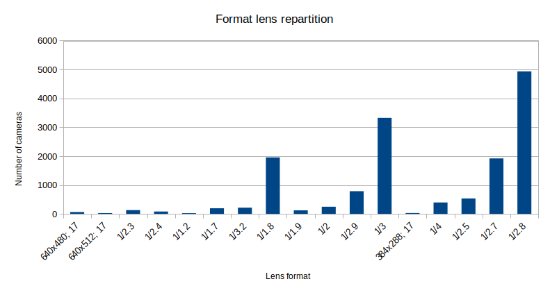

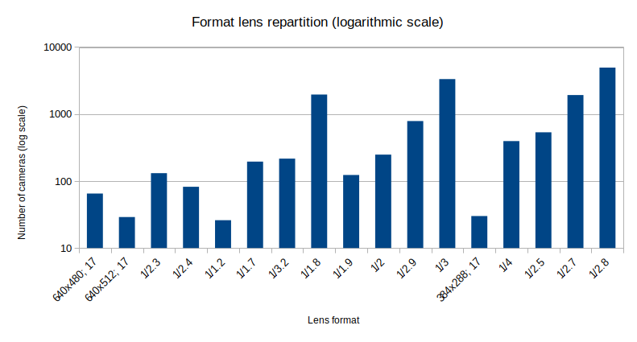

#### Resolution repartition

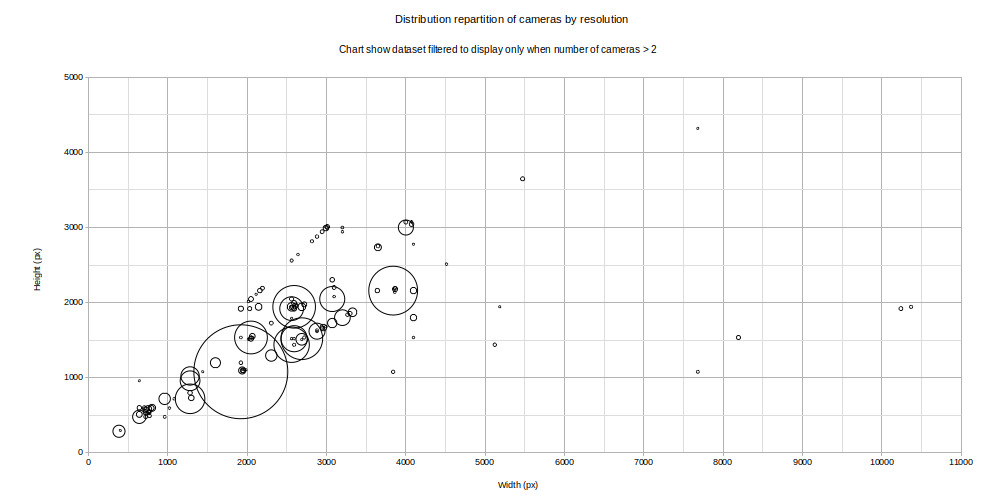

#### Focals repartition

Those numbers are the minimum/average/maximum focal available for each camera product. Some cameras only have one focal so each numbers will be the same. But some others can zoom and change their focal therefore these categorization has been made.

##### Minimum focal

**Fixed cameras**

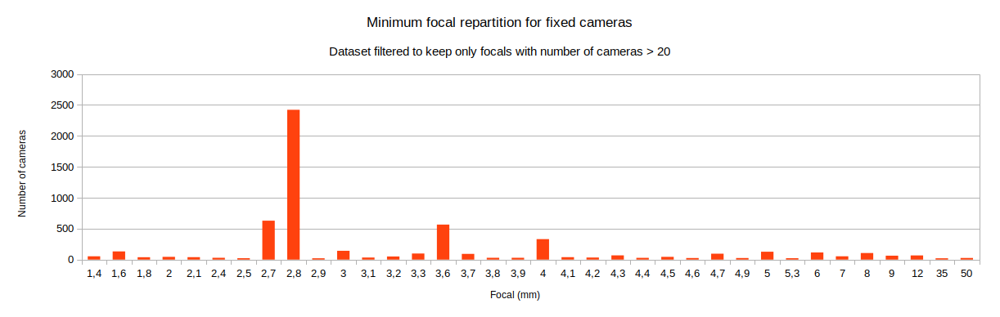

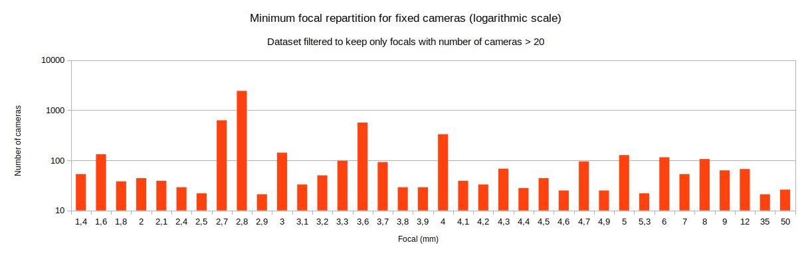

**Dome/PTZ cameras**

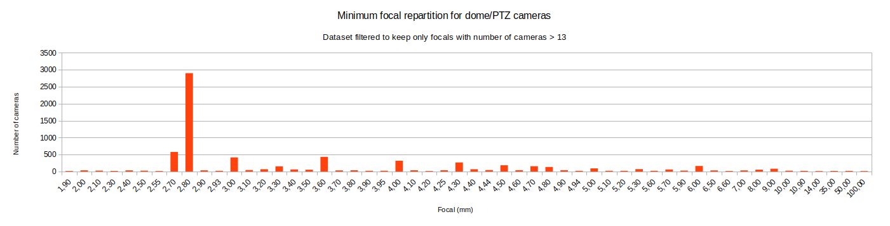

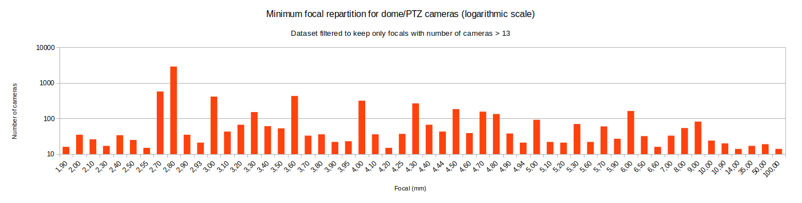

##### Average focal

**Fixed cameras**

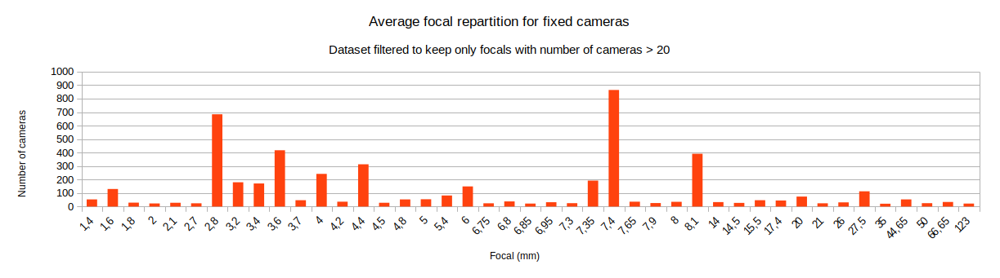

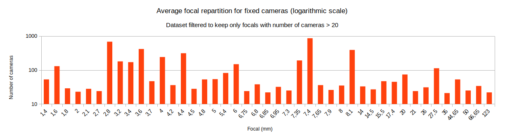

**Dome/PTZ cameras**

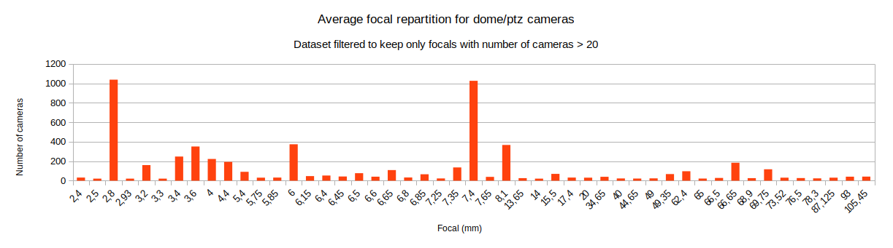

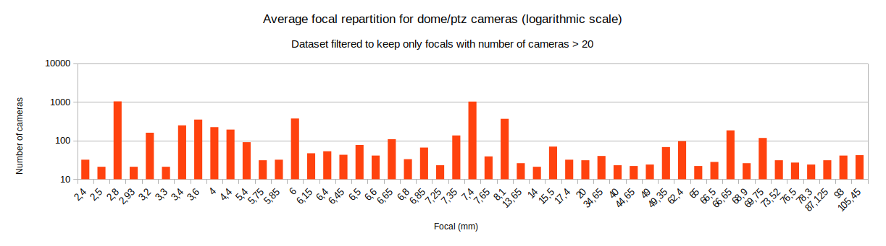

##### Maximum focal

**Fixed cameras**

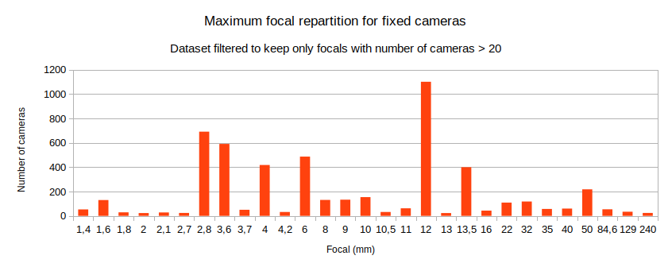

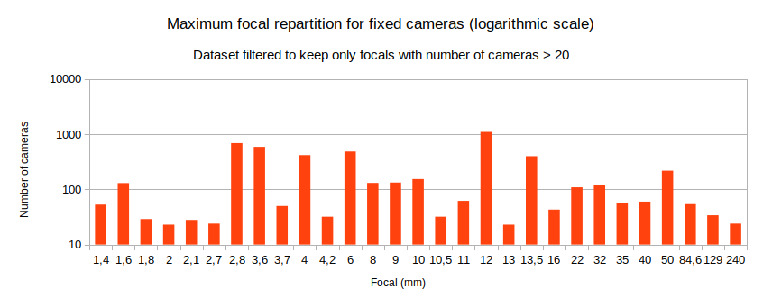

**Dome/PTZ cameras**

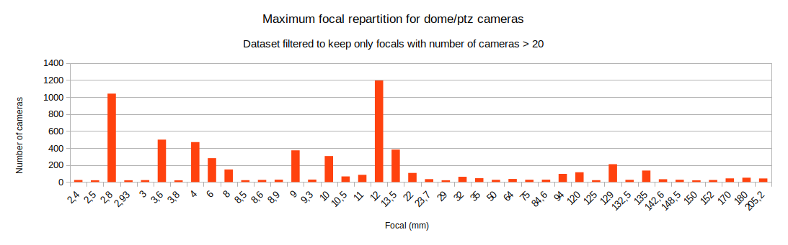

## More information

Wow, you're still there ? I guess you're really interested in this project. Here is some usefull information and resources.

### Create or tag multiple cameras on same location

If you see multiple cameras at the same location (for example on the same pole), it is advised to create one entry for each camera and set the location the closest as possible. This way it will ensure the logic "one node in OSM = one object in real life".

This way of representing objects has been discussed in the community and seems to be the recommanded way:

- See [this discussion](https://community.openstreetmap.org/t/how-to-tag-multiple-cameras-on-one-supporting-pole/2070) (in english)
- Or [almost the same](https://forum.openstreetmap.fr/t/marquer-plusieurs-cameras-sur-un-meme-mat/13427) (in french)
