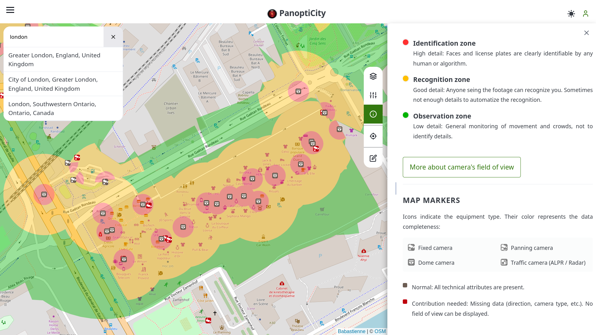
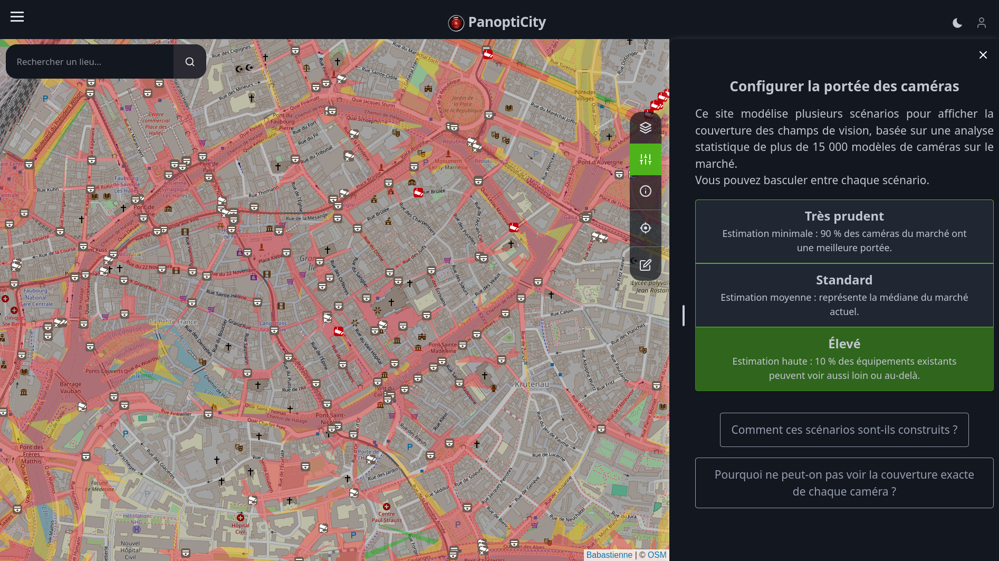
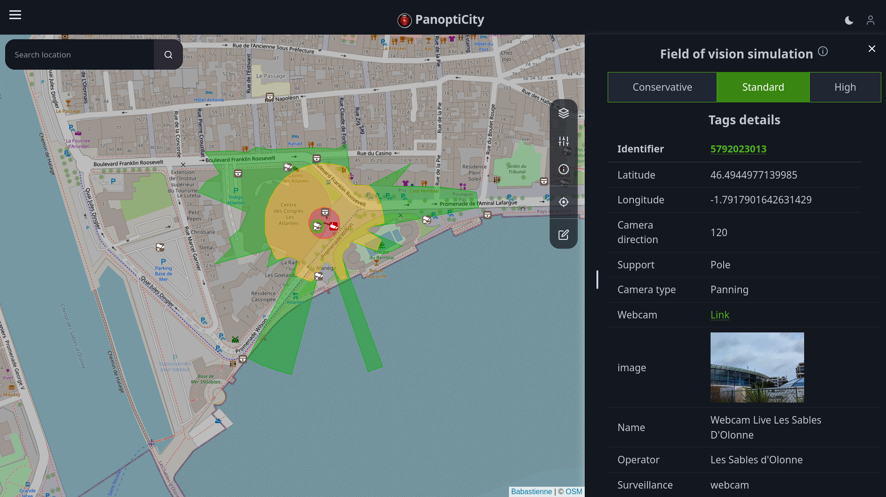
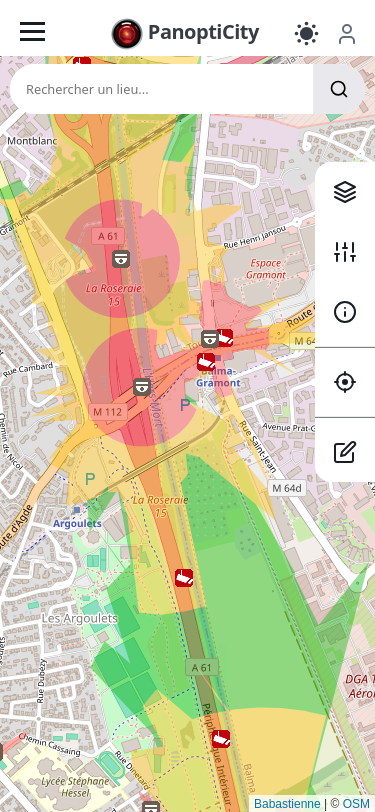
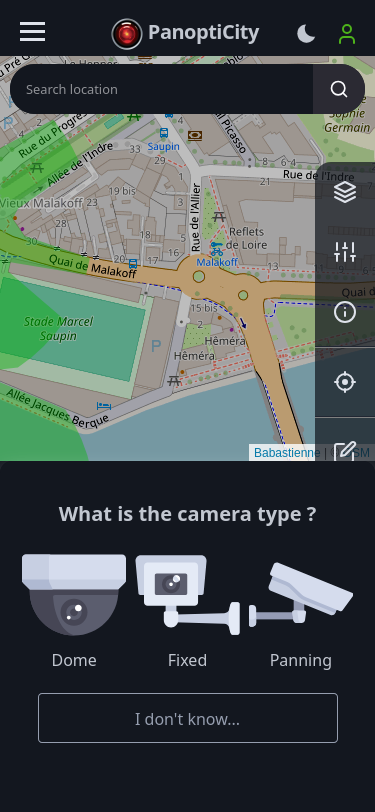
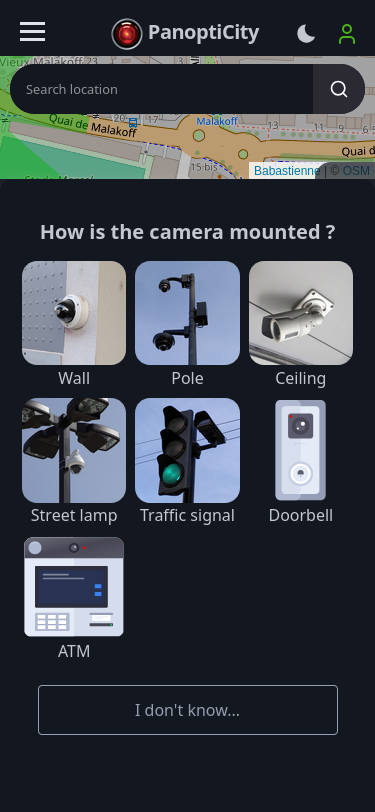
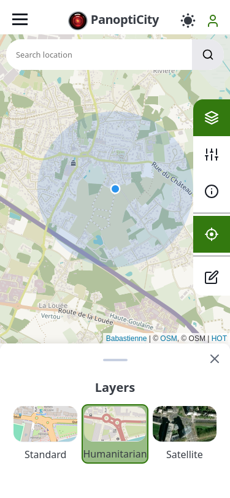
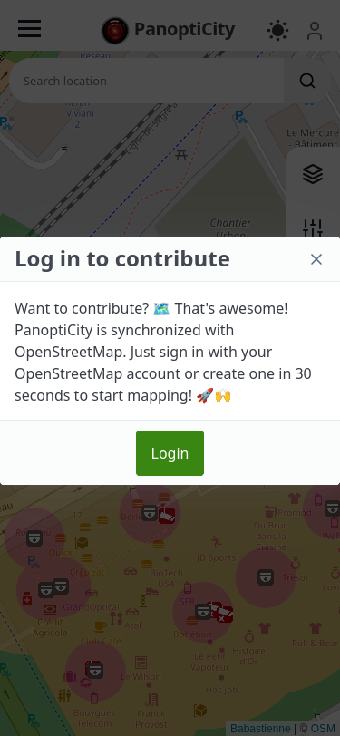
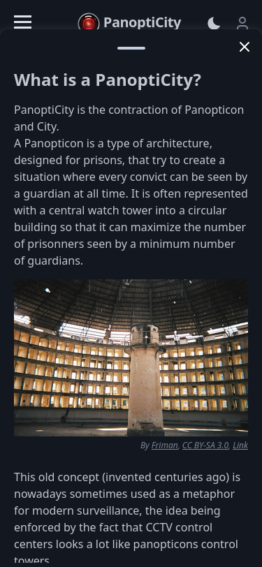

<h1 align="center">PanoptiCity</h1>

<bold>A life under surveillance</bold>

  
  

## Introduction

Welcome to PanoptiCity !

This project's purpose is to help display information about CCTV, cameras, to easily map where they are, what they can see, and get data about their usage in cities. The website also give users an easy way to contribute into the OpenStreetMap database if they want to add cameras when they see some that are not already known or improve the attributes of existing ones.

PanoptiCity is my way to act and try to raise awareness about mass surveillance in all cities, to make people realize the amount of cameras around us that they usually not even see. In a time were artifical intelligence is generalizing, it is more than ever the moment to ask ourselves, is it really the model of society we want to build collectively ?

**To learn more about the core ideas behind PanoptiCity, see the [complete manifesto](https://babastienne.github.io/PanoptiCity/manifest).**

### Supported features

- Get data from OpenStreetMap database
- Compute field of vision of each camera, take in consideration surounding buildings
- Mutliple models for field of vision computation, based on an analysis of the technical features of available cameras on the cctv market. Possiblity to switch between models.
- Connection with OpenStreetMap account
- Edition of existing cameras
- Creation form to contribute new cameras
- Dark/light mode

To discover all the features, go to [panopticity.fr](https://panopticity.fr/) !

## Documentation

The entire technical documentation is available directly on [https://babastienne.github.io/PanoptiCity/](https://babastienne.github.io/PanoptiCity/). It covers:

- Installation
- Configuration
- Architecture
- Performances
- Development
- Contributions

### Screenshots

|                |  |
| ------------------------------------------------------------------------- | ----------------------------------------------------------------------- |
|  |    |
|                      |      |
