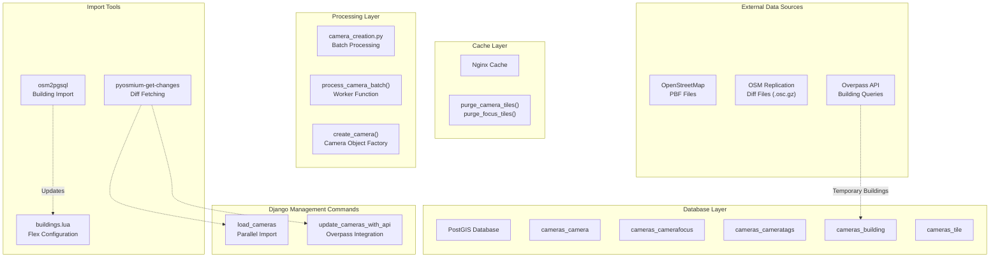
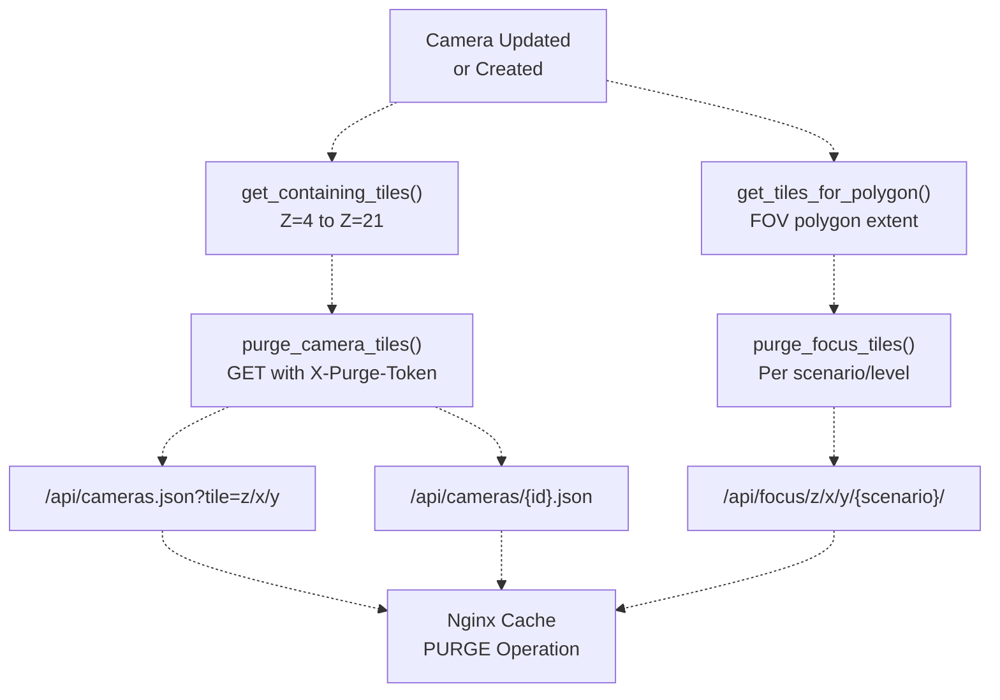

# Data import and management
{: .no_toc }

## Table of contents
{: .no_toc .text-delta }

- TOC
{:toc}

---

This document provides a high-level overview of PanoptiCity's data import and management system, including the strategies, components, and workflows for synchronizing surveillance camera data from OpenStreetMap (OSM). 

---

## Import strategy overview

PanoptiCity implements two distinct data import strategies that differ in how building geometries are stored and accessed during FOV (Field of View) calculations.

### Local buildings mode

In this mode, building geometries from OpenStreetMap are permanently stored in the `cameras_building` table using `osm2pgsql`. Camera FOV calculations query this local database, enabling fast updates but requiring significant storage space.

**Characteristics:**

* Full building database stored locally in PostGIS
* Faster camera updates (no external API calls)
* Larger database footprint (depends on geographic coverage)
* Uses `load_cameras` management command for updates
* Suitable for production environments with ample storage

{: .note }
This strategy is recommanded for low instances (small areas like countries or cities). It is heavier on the disk but way faster.

### Overpass API mode

In this mode, the `cameras_building` table remains empty. For each camera update, the system queries the Overpass API to fetch only the buildings needed for that specific camera's FOV calculation. Buildings are temporarily stored during processing and then dropped.

**Characteristics:**

* Minimal database storage (no persistent building data)
* Slower camera updates (external API calls per camera)
* Requires reliable internet connection to Overpass API
* Uses `update_cameras_with_api` management command
* Suitable for resource-constrained environments

{: .note }
This strategy is recommanded for large instances (entire worls areas, or continents) or very small servers. It is lighter on the disk but way slower.

---

## System architecture

This diagram illustrates the complete data import pipeline, showing how data flows from external OSM sources through various import tools and processing layers into the database, with nginx cache invalidation occurring as a final step.

---

## Cache invalidation strategy

A strong cache strategy is used to help serving faster results during production phase.

All import operations must therefore invalidate Nginx cache entries for affected map tiles to ensure users see updated camera data immediately.

This diagram represents the cache purging machanism.

The system uses HTTP GET requests with a special `X-Purge-Token` header to trigger Nginx cache invalidation:
