# Installation procedure and camera loading
{: .no_toc }

## Table of contents
{: .no_toc .text-delta }

1. TOC
{:toc}

---

## Purpose and scope

This document covers the initial setup and data import process for PanoptiCity, including the installation script, the `load_cameras` management command, and the parallel processing architecture used for efficient camera data import from OpenStreetMap files.

---

## Installation workflow

The initial setup process consists of multiple phases executed by the `install.sh` script. Each phase builds upon the previous one to create a fully functional PanoptiCity instance.

```mermaid
flowchart TD

Start["User runs install.sh"]
CheckDocker["Check Docker installation"]
CreateEnv["Create/validate .env file"]
SetVars["Set environment variables:<br>POSTGRES_*, FRONTEND_DOMAIN_NAME,<br>BACKEND_DOMAIN_NAME, etc."]
BuildBackend["docker compose build"]
StartPostGIS["docker compose up -d postgis"]
WaitDB["Wait for PostGIS:<br>'database system is ready'"]
Migrate["docker compose run web<br>./manage.py migrate"]
ImportTiles["Import tile structure:<br>tiles.sql.gz"]
FirstPass["FIRST PASS:<br>load_cameras without buildings<br>-w NUM_CORES /osm-data/FILE"]
ImportBuildings["osm2pgsql -O flex<br>-S buildings.lua"]
TruncateTables["TRUNCATE cameras_camera,<br>cameras_camerafocus,<br>cameras_cameratags"]
SecondPass["SECOND PASS:<br>load_cameras with buildings<br>-w NUM_CORES /osm-data/FILE"]
GenerateState["pyosmium-get-changes -O<br>Generate sequence.state.txt"]
UpdateEnv["Add REPLICATION_SERVER_URL<br>to .env"]
DropBuildings["TRUNCATE cameras_building"]
ConfigureNginx["Configure Nginx"]
HTTPMode["Start Nginx in HTTP mode"]
Certbot["Request Let's Encrypt cert"]
CheckCert["Certificate<br>obtained?"]
SSLMode["Switch to nginx.ssl.template"]
KeepHTTP["Keep nginx.http.template"]
GenerateConfig["Generate front-end/CONFIG.js"]
End["Installation complete"]

Start -.-> CheckDocker
CheckDocker -.-> CreateEnv
CreateEnv -.-> SetVars
SetVars -.-> BuildBackend
BuildBackend -.-> StartPostGIS
StartPostGIS -.-> WaitDB
WaitDB -.-> Migrate
Migrate -.-> ImportTiles
ImportTiles -.-> FirstPass
FirstPass -.-> ImportBuildings
ImportBuildings -.-> TruncateTables
TruncateTables -.-> SecondPass
SecondPass -.->|"Yes"| GenerateState
GenerateState -.->|"No"| UpdateEnv
UpdateEnv -.->  DropBuildings
DropBuildings -.-> ConfigureNginx
ConfigureNginx -.-> HTTPMode
HTTPMode -.-> Certbot
Certbot -.-> CheckCert
CheckCert -.-> SSLMode
CheckCert -.-> KeepHTTP
SSLMode -.-> GenerateConfig
KeepHTTP -.-> GenerateConfig
GenerateConfig -.-> End
```

As you can see, there is a double Camera import during this installation. This is crucial for performance. The first pass computes FOV polygons without building data (fast, generates bounding boxes), which are then used to determine the spatial extent for building import. This way the volume of buildings to import is way lower, for a lighter database and making the second pass efficient.

The second pass recomputes FOV polygons with actual building obstructions.

**First pass (no buildings)**:

* Cameras processed without building data
* FOV polygons computed using maximum theoretical distances
* Fast processing
* Establishes spatial bounding boxes for each camera

**Building import**:

* `osm2pgsql` imports buildings only within camera FOV extents
* Reduces database size significantly
* Uses spatial filtering based on first-pass FOV polygons

**Second pass (with buildings)**:

* Previous camera data truncated
* Cameras reprocessed with actual building data
* FOV polygons recomputed with building intersections
* Final, accurate FOV polygons stored

---

## Installation script components

### Environment configuration

The `install.sh` script uses an interactive configuration system to set up required environment variables:

| Variable                 | Default          | Purpose                      |
| ------------------------ | ---------------- | ---------------------------- |
| `POSTGRES_DB`            | postgres         | Database name                |
| `POSTGRES_USER`          | postgres         | Database username            |
| `POSTGRES_PASSWORD`      | postgres         | Database password            |
| `POSTGRES_PORT`          | 5452             | Database port                |
| `FRONTEND_DOMAIN_NAME`   | **(required)**   | Frontend domain              |
| `BACKEND_DOMAIN_NAME`    | **(required)**   | Backend API domain           |
| `CERTBOT_EMAIL`          | **(required)**   | Email for SSL certificates   |
| `CLIENT_ID_OSM_APP`      | **(required)**   | OSM OAuth client ID          |
| `UPDATE_WITH_OVERPASS`   | y                | Use Overpass API for updates |
| `SECRET_KEY`             | (auto-generated) | Django secret key            |
| `NGINX_CACHE_SECRET_KEY` | (auto-generated) | Cache purge secret           |

### Worker configuration

The script automatically detects CPU core count on the running machine to optimize parallel processing.

This value is then passed to the `load_cameras` command via the `-w` flag.

---

## The `load_cameras` command

### Command structure

The `load_cameras` command is used during the installation process. This is a Django management command located at [back-end/cameras/management/commands/load_cameras.py](https://github.com/babastienne/PanoptiCity/blob/32d49fab/back-end/cameras/management/commands/load_cameras.py)

The command supports multiple configuration flags:

| Argument        | Short | Type | Default            | Description                          |
| --------------- | ----- | ---- | ------------------ | ------------------------------------ |
| `camera_file`   | -     | str  | (required)         | Path to OSM PBF or XML file          |
| `--recreate`    | `-r`  | flag | False              | Force recreation of existing cameras |
| `--details`     | `-d`  | flag | False              | Include detailed logs                |
| `--batch-size`  | `-b`  | int  | 100                | Cameras per batch                    |
| `--max-workers` | `-w`  | int  | 4                  | Number of worker processes           |
| `--log-file`    | `-l`  | str  | import_cameras.log | Log file path                        |

The `--recreate` flag is usefull to re-compute existing cameras and update the database. It is not used during the second import in the installation process because we truncate the tables before. fo efficiency reasons. The `--recreate` flag will also invalidate the nginx cache for affected cameras.

---

## Parallel processing

The `load_cameras` command handle multi-processing using multiple workers.

Each worker process is independent and handles a batch of cameras. The architecture uses Python's `ProcessPoolExecutor` for parallel processing (bypassing the GIL).

Each worker maintinas its own database connection.
This prevents connection sharing between parent and child processes, which would cause database errors.

---

## Camera Creation Process

During the creatio of a camera, some adjustements are made to simplify the data and get exploitable values for computation.

### Direction computation

The raw data is kepts but a clone is made and transformed to help convert some information into treatable values.

**Conversion Table:**

| Input             | Output (degrees) | Notes              |
| ----------------- | ---------------- | ------------------ |
| "n", "north", "N" | 0                | North              |
| "ne", "NE"        | 45               | Northeast          |
| "e", "east", "E"  | 90               | East               |
| "se", "SE"        | 135              | Southeast          |
| "s", "south", "S" | 180              | South              |
| "sw", "SW"        | 225              | Southwest          |
| "w", "west", "W"  | 270              | West               |
| "nw", "NW"        | 315              | Northwest          |
| "90°"             | 90               | Trailing ° removed |
| "45;90;135"       | 45               | First value taken  |

### FOV generation

We choose to compute the Field Of View of a camera only when it is possible.

**Conditions for FOV computation:**

1. **Fixed cameras**: Requires a direction
2. **Dome/panning cameras**: No requirement
3. **All other cameras**: If there is no type associate with the camera, no FOV is computed
